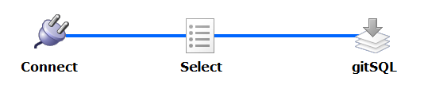
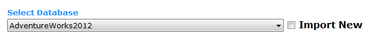
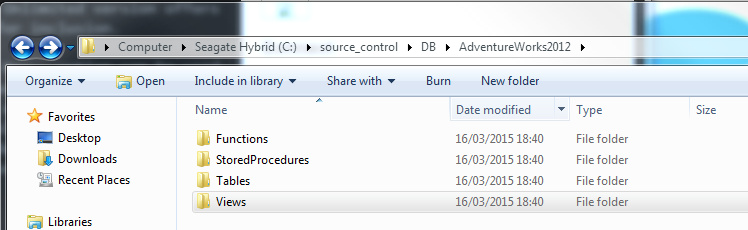

##Overview

---

### gitSQL has three main screens

 1. 1 Connect
 2. 2 Select
 3. 3 gitSQL  

 
 

### 1. Connect
The first step is to add database credentials for the database you wish to export from or import to.  

The example screenshot shows a connection to an SQL Server Express instance on the network.

__Hint__:

Leave the Server field empty if the instance is on the same computer from where you are running gitSQL.  

__Are you connecting to a full instance of SQL Server?__

Try leaving the instance  field empty and enter 'localhost' or the Computer IP/Name you wish to connect to.

A test button is available at the bottom right of the screen. This needs to be pressed before we can continue to the next stage.

Any connection issues will be shown in the console to help diagnose problems.

 
 

### 2. Select
A dropdown control will show containing a list of available databases.

You must select one from the list to load a list of objects.

You will now have options to select all objects and data, None, Schema Only or Data Only.

Alternatively you may select items individually through the treeview control.

__N.B.__ The screenshot shows the free version which only loads four objects. The Unlimited version offers all objects for inclusion.

The __Import New__ option can be used if the database does not show in the list and you wish to load it from source control - or if you wish to overwrite a database in the list with a copy from source control.

  

### 3. gitSQL

The final screen contains a Source Control Path which should point to a folder within your source control project.

Select Export or Import... in this example we are going to Export.

Review the objects that you wish to export. Press back if you wish to make amendments - otherwise press Run.

You will now see a progress bar and completed items in the object list in the colour green once they have been completed.

gitSQL will create a DB folder, and then a folder inside that which is the database name.

All exported objects will be in their type folders respectively as __.SQL__ files.

The __DATA__ will be exported to the __Tables\Data__ folder.
