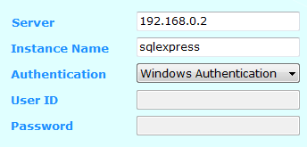
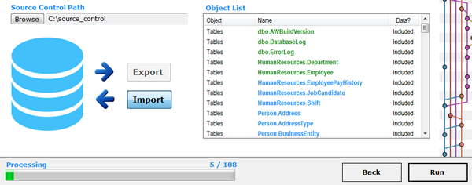

##Import Database from Source Control

---

  

### 1. Connect
Connect to the database you wish to import into

The example screenshot shows a connection to an SQL Server Express instance on the network.

__Hint__:

Leave the Server field empty if the instance is on the same computer from where you are running gitSQL.

__Are you connecting to a full instance of SQL Server?__

Try leaving the instance  field empty and enter 'localhost' or the Computer IP/Name you wish to connect to.

A test button is available at the bottom right of the screen. This needs to be pressed before we can continue to the next stage.

Any connection issues will be shown in the console to help diagnose problems.

  

### 2. Select

Select __Import New__ and then __Next__.

  

### 3 .gitSQL

Select the source control path you wish to import from.

Press Run.

Select __Yes__ if you are happy to overwrite if the database already exists locally.
Select __No__ if you wish to export the latest database changes first.

 

gitSQL will then discover objects and data from the source control directory and populate an objects list and then process the list.

__N.B.__ You will be prompted if more than one database is found so you can select which database you wish to import.
