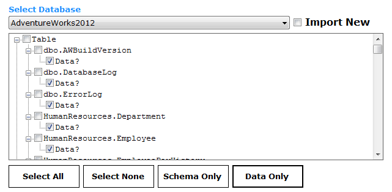
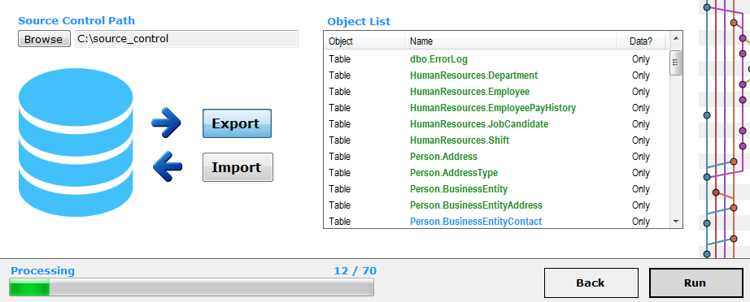

##Export Table Data to Source Control

---
  

### 1. Connect
Connect to the database you wish to export from

The example screenshot shows a connection to an SQL Server Express instance on the network.

__Hint__:

Leave the Server field empty if the instance is on the same computer from where you are running gitSQL.

__Are you connecting to a full instance of SQL Server?__

Try leaving the instance  field empty and enter 'localhost' or the Computer IP/Name you wish to connect to.

A test button is available at the bottom right of the screen. This needs to be pressed before we can continue to the next stage.

Any connection issues will be shown in the console to help diagnose problems.

  

### 2. Select
Select the database you wish to export.

Select Data Only. This will select all DATA items in the tables node.

__Alternatively__, select the table data you wish to export.

This is especially handy if you want to update source control for a single data table.

  

### 3. gitSQL

Select the source control path you wish to export to.

Select Export.

Review the objects that you wish to export. Press back if you wish to make amendments - otherwise press Run.

 

You will now see a progress bar and completed items in the object list in the colour green once they have been completed.
